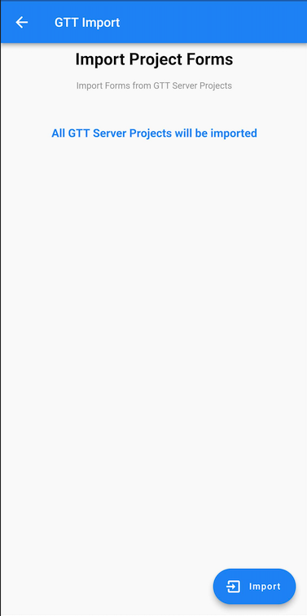
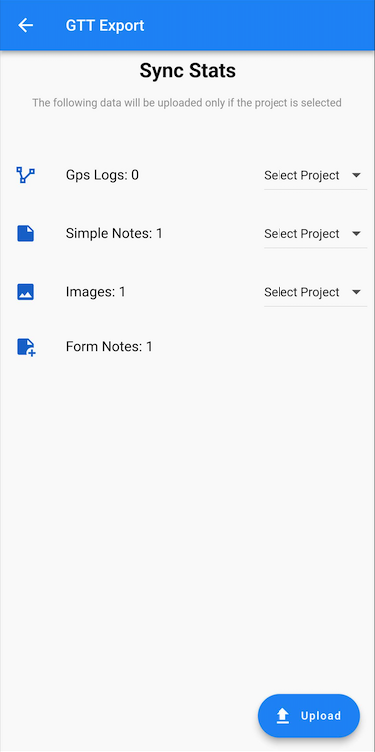

# Getting Started with GTT SMASH plugin

The **Redmine GTT SMASH** plugin allows you to connect your [Redmine GTT](https://gtt-project.org/)
projects with the [SMASH mobile app](https://www.geopaparazzi.org/smash/index.html)
to create field notes and upload them as issues to [Redmine](https://redmine.org/).

SMASH is a digital field mapping application developed to perform fast
qualitative engineering/geologic surveys and GIS data collection.

## Installing SMASH

You can install the SMASH app from the app stores:

* *SMASH Digital field mapping* for iOS devices on the [Apple Store](https://apps.apple.com/us/app/smash-digital-field-mapping/id1475079936).
* *SMASH field mapping* for Android devices on the [Google Play store](https://play.google.com/store/apps/details?id=eu.hydrologis.smash&hl=en).

The following plugin documentation gives a brief introduction to how to use
SMASH with Redmine.

SMASH provides additional functionality that is available in the [SMASH User Manual](https://www.geopaparazzi.org/smash/index.html).

## Integration in Redmine GTT

To get projects connected with the SMASH mobile application make sure to enable
the **GTT SMASH** module in your Redmine project settings.

Set the trackers and default subject for the notes or logs in the plugin setting
of **Redmine GTT SMASH** so that the issue can be created based on the setting.

## Connect SMASH mobile application to Redmine

### Connect Redmine account

In SMASH mobile application top menu go to **Export** or **Import**. Click on
the gear icon of **GTT** and you will see the following:

 

* **Server URL**: enter your Redmine URL `example.com`
* **Server Username**: your Redmine account's `username`
* **Server Password**: your Redmine account's `password`

### Import Redmine projects

In menu again go to **Import** &#8594; **GTT** &#8594; Click **Import**

This will import your project's form configuration to mobile storage.

### Create issue

In the SMASH application you can create Simple Notes, Form Notes, etc. Form
Notes can be exported to your Redmine project as **issue**.

:::caution
Only *Form Notes* are currently supported in combination with Redmine GTT!
:::

Follow these steps to upload your notes as issues or synchronize changes:

1. Go to top menu **Export** &#8594; **GTT**
2. It will indicate if there is new data to be uploaded
3. Choose a project for each note or GPS log to create the issue(s)
   *(unselected will be ignored)*
4. Click on **Upload** to export the issue(s)

Your issues will be created (or updated) in the specified project.
